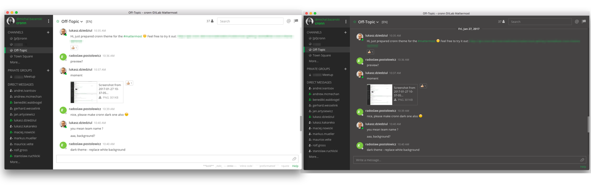

Mattermost themes from cronn
============================


### Setup

Click on the hamburger menu next to your profile on the top the Mattermost and choose `Account settings -> Display -> Theme`,
switch to `Custom Theme` and paste:

##### Mattermost 4.x:

* cronn The Light Side:
```json
{
  "awayIndicator": "#8a99b7",
  "buttonBg": "#10ad58",
  "buttonColor": "#ffffff",
  "centerChannelBg": "#ffffff",
  "centerChannelColor": "#444444",
  "codeTheme": "github",
  "dndIndicator":"#f74343",
  "errorTextColor":"#fd5960",  
  "linkColor": "#1e9949",
  "mentionBg":"#1e9949",  
  "mentionBj": "#1e9949",
  "mentionColor": "#ffffff",
  "mentionHighlightBg": "#f08d80",
  "mentionHighlightLink": "#ffffff",
  "newMessageSeparator": "#10ad58",
  "onlineIndicator": "#19cb3f",
  "sidebarBg": "#262626",
  "sidebarHeaderBg": "#363636",
  "sidebarHeaderTextColor": "#19cb3f",
  "sidebarText": "#ffffff",
  "sidebarTextActiveBorder": "#10ad58",
  "sidebarTextActiveColor": "#ffffff",
  "sidebarTextHoverBg": "#525252",
  "sidebarUnreadText": "#ffffff"
}
```

* cronn The Dark Side:
```json
{
  "awayIndicator": "#8a99b7",
  "buttonBg": "#10ad58",
  "buttonColor": "#ffffff",
  "centerChannelBg": "#454343",
  "centerChannelColor": "#e5e5e5",
  "codeTheme": "monokai",
  "dndIndicator": "#f74343",
  "errorTextColor": "#fd5960",  
  "linkColor": "#27a854",
  "mentionBg": "#1e9949",  
  "mentionBj": "#1e9949",
  "mentionColor": "#ffffff",
  "mentionHighlightBg": "#f08d80",
  "mentionHighlightLink": "#444444",
  "newMessageSeparator": "#10ad58",
  "onlineIndicator": "#19cb3f",
  "sidebarBg": "#262626",
  "sidebarHeaderBg": "#363636",
  "sidebarHeaderTextColor": "#19cb3f",
  "sidebarText": "#ffffff",
  "sidebarTextActiveBorder": "#10ad58",
  "sidebarTextActiveColor": "#ffffff",
  "sidebarTextHoverBg": "#525252",
  "sidebarUnreadText": "#ffffff"
}
```

##### Mattermost 3.x:

* cronn The Light Side:
`#262626,#ffffff,#363636,#19cb3f,#ffffff,#525252,#10ad58,#ffffff,#19cb3f,#c9c9c9,#1e9949,#ffffff,#ffffff,#444444,#10ad58,#dfffdd,#1e9949,#444444,#10ad58,#ffffff,github`

* cronn The Dark Side:
`#262626,#ffffff,#363636,#19cb3f,#ffffff,#525252,#10ad58,#ffffff,#19cb3f,#c9c9c9,#1e9949,#ffffff,#454343,#e5e5e5,#10ad58,#dfffdd,#27a854,#444444,#10ad58,#ffffff,monokai`

Click `Save`
